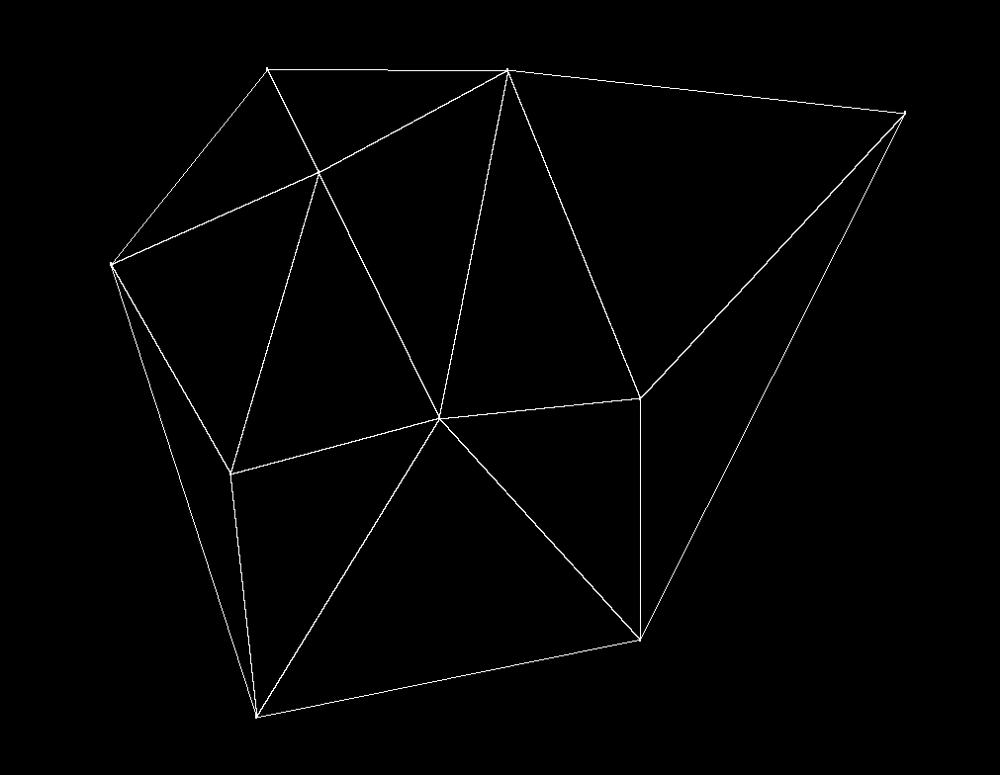

# delaunay_triangulation
## Bowyer–Watson algorithm
In computational geometry, the [Bowyer–Watson algorithm](https://en.wikipedia.org/wiki/Bowyer%E2%80%93Watson_algorithm) is a method for computing the Delaunay triangulation of a finite set of points in any number of dimensions. The algorithm can be also used to obtain a Voronoi diagram of the points, which is the dual graph of the Delaunay triangulation. 
```
function BowyerWatson (pointList)
   triangulation := empty triangle mesh data structure
   add super-triangle to triangulation
   for each point in pointList do
      badTriangles := empty set
      for each triangle in triangulation do 
         if point is inside circumcircle of triangle
            add triangle to badTriangles
      polygon := empty set
      for each triangle in badTriangles do 
         for each edge in triangle do
            if edge is not shared by any other triangles in badTriangles
               add edge to polygon
      for each triangle in badTriangles do 
         remove triangle from triangulation
      for each edge in polygon do 
         newTri := form a triangle from edge to point
         add newTri to triangulation
   for each triangle in triangulation
      if triangle contains a vertex from original super-triangle
         remove triangle from triangulation
   return triangulation
```

## How to use
```
git clone https://github.com/Taintedy/delaunay_triangulation.git
cd  delaunay_triangulation
python3 main.py -m "Run"
